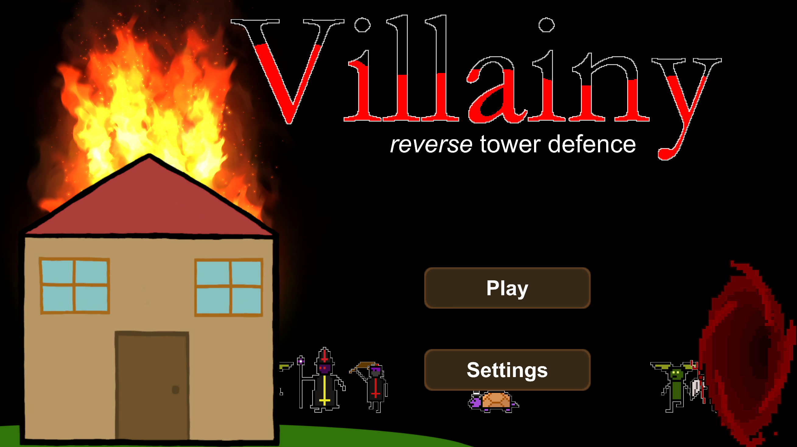
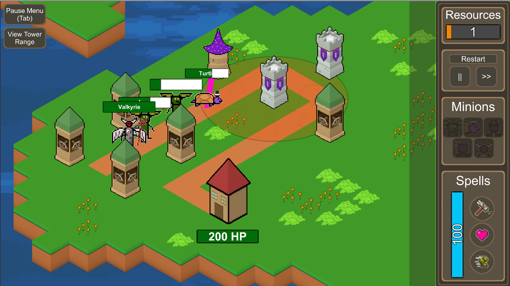
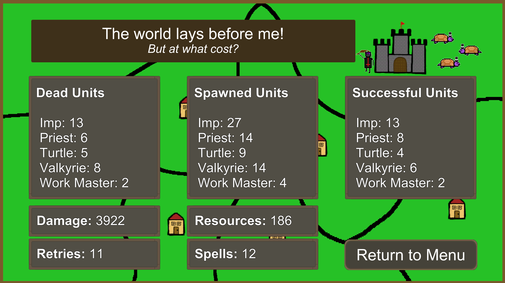

# Villainy

    

Playable at <a href="https://garth.wales/Villainy">https://garth.wales/Villainy</a>
or at <a href="https://cosc360.otago.ac.nz/games/2020/Villainy">https://cosc360.otago.ac.nz page</a>

---

Developed in 6 weeks for <a href="https://cosc360.otago.ac.nz/">**COSC360**</a>
*   Garth Wales - Lead Designer / Programmer
*   Damian Soo - Artist / Audio
*   Max Edwards - Programmer / Artist
*   Spring Han - Programmer

---
**Core concept**

Villainy is a reverse tower defense game where you send units to overcome tower defenses and achieve world domination.

---

Controls:
- Click units, spells and other buttons to play. Tooltips and tutorial will help.
- tab to open pause menu.
- space to pause/unpause gameplay.
- 1, 2, 3 keys to select spells, click to cast, right click to cancel
---

See the wiki for planning documents

Examples (what I worked on)
- <a href="https://github.com/GenericPath/Villainy/wiki">Homepage, the starting plan</a>
- <a href="https://github.com/GenericPath/Villainy/wiki/Economy">Economy of resources planning</a>
- <a href="https://github.com/GenericPath/Villainy/wiki/LevelDesign">Level Design</a>

---
Known Issues:

- The game behaves differently when double speed is used and some solutions change.
    - Simple enough fix but it did allow some clever solutions!
---
Credits:

All music is royalty free and courtesy of:
- Of Far Different Nature, https://fardifferent.carrd.co
- Bobjt, http://bobjt.com
- Miguel Herrero
- Matthew Pablo, matthewpablo.com
- cynicmusic, http://pixelsphere.org
- kenney, kenney.nl
- PhilSavlem on freesounds.org
- Oiboo, qubodup & spookymodem on opengameart.org
